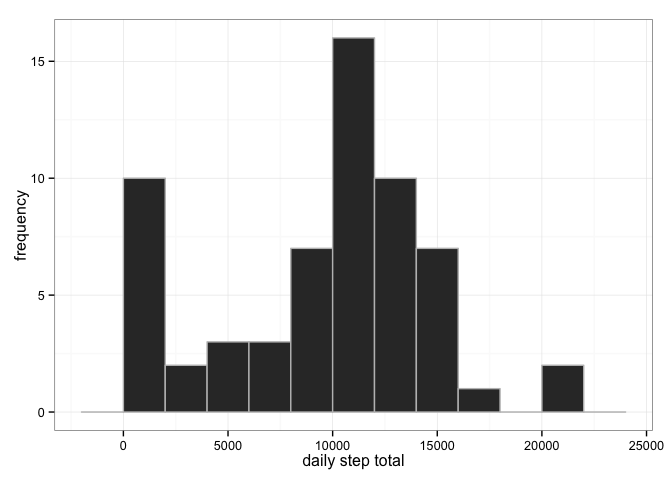
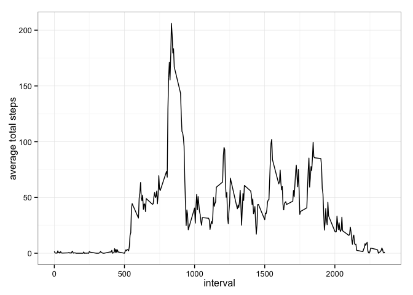
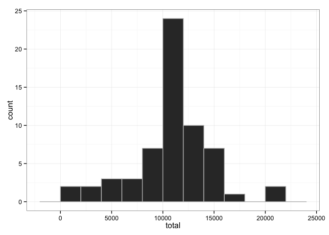
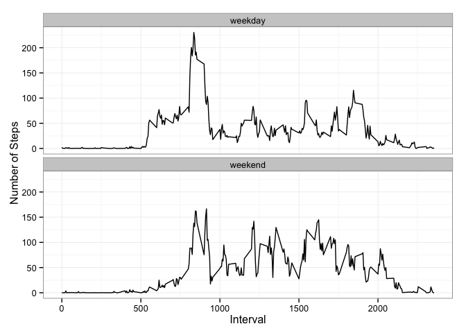

# Reproducible Research: Peer Assessment 1


## Loading and preprocessing the data
We begin by simply reading the CSV file into a data frame, and then generate summary data frames to use for analysis later...

```r
#setwd('/Users/tom/Desktop/JHU Data Science/5-reproducible research/assessment1')
library(plyr)
rawdata<-read.csv('activity.csv', colClasses=c("integer", "Date", "integer"))
## Summarise total steps per date (over intervals), and remove any NA values...
daySummary <- ddply(rawdata, .(date), summarise, total=sum(steps, na.rm=TRUE))
## Summarise average steps per interval (over days) 
intSummary <- ddply(rawdata, .(interval), summarise, avg=mean(steps, na.rm=TRUE))
```


## What is mean total number of steps taken per day?
Let's examine a histogram showing the frequency of various step totals per day, using a bin width of 2000 steps:
 

Summarising over the entire data set,

```r
## Calculate our summary statistics
dayMean <- mean(daySummary$total)
dayMedian <- median(daySummary$total) 
```
The mean daily step total is **9354.23** steps.  The median daily step total is **10395** steps.


## What is the average daily activity pattern?
To illustrate daily patterns (activity across intervals), we'll use a line plot based on the second summary data frame generated earlier ('intSummary'):
 

Averaging across all dates in this data set, the peak average in total steps (206.2) occurs at interval **835**


## Imputing missing values
Ths data set contains some amount of missing data (encoded as 'NA'). Re-examining the raw data, we find that there are **2304** missing values.

This void in data collection can skew the various statistics above by over-estimating the number of "zero" values when computing histograms and other measures based on daily totals.  We can mitigate this by subsituting any 'NA' values with the corresponding interval average (as plotted above).


```r
## first, merge the raw data with the interval summary data, matching intervals...
newdata<-merge(rawdata, intSummary, by="interval")
## second, copy the interval avg into the "steps" column for those rows with 'NA' for step counts
newdata[is.na(newdata$steps),]$steps<-newdata[is.na(newdata$steps),]$avg
```

Re-generating the histogram and summary statistics as above with this modified data set,

 

We see that the general shape of the histogram is preserved, with the exception of the removal of the large "bulge" covering the bin containing "zero" steps.  This reduction in the skewness is refelcted in the summary statistics as well: the median total steps (**10766.2**) is increased slightly, but the mean total steps (**10766.2**) has risen more substantially (moving away from zero and closer to the peak on the histogram) and is now equal to the median.

## Are there differences in activity patterns between weekdays and weekends?
We'll use the modified data set from the previous section for this.  Augmenting our data frame to reflect weekdays vs. weekend days, and then summarising by interval vs weekend/weekday:


```r
newdata$weekend<-factor(weekdays(newdata$date) %in% c("Saturday","Sunday"), labels=c("weekday", "weekend"))
newIntSummary <- ddply(newdata, .(interval, weekend), summarise, avg=mean(steps))
```

We can now compare average step activity across intervals for weekdays vs. weekends:

 

Clearly, the plots above indicate that weekday activity is very different than weekend activity... While some features of the plot shapes are similar (e.g. an initial "spike" in the mornings), weekend activity appears to be more evenly distributed across the day.

